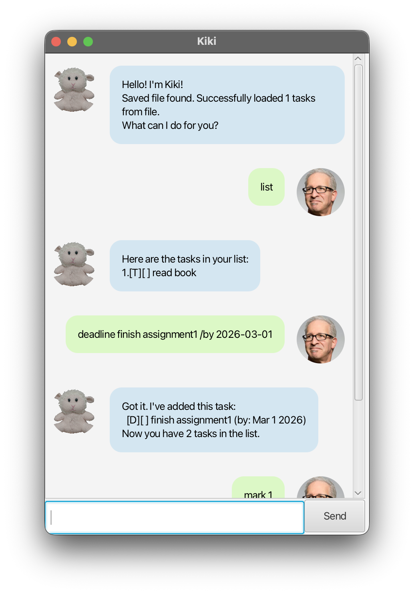

# Kiki User Guide



Kiki is a desktop task management application designed for users who prefer typing. It offers a clean, sleek Graphical User Interface (GUI) created with JavaFX while allowing you to manage your daily tasks with the speed of a Command Line Interface (CLI).

## Adding a To-Do

Adds a task that does not have a specific date or time attached to it.

Example: `todo <description>`

* `todo Buy new film rolls for Nikon F601`

```
Got it. I've added this task:
  [T][ ] Buy new film rolls for Nikon F601
Now you have 1 tasks in the list.
```

## Adding a Deadline

Adds a task that needs to be done before a specific date. The date must be provided in `yyyy-mm-dd` format.

Example: `deadline <description> /by <date>`

* `deadline Submit CS2109S problem set /by 2026-02-25`

```
Got it. I've added this task:
  [D][ ] Submit CS2109S problem set (by: Feb 25 2026)
Now you have 2 tasks in the list.
```

## Adding an Event

Adds a task that starts at a specific time and ends at a specific time.

Example: `event <description> /from <start> /to <end>`

* `event Bouldering session /from 2026-02-24 /to 2026-02-24`

```
Got it. I've added this task:
  [E][ ] Bouldering session (from: 2026-02-24 to: 2026-02-24)
Now you have 3 tasks in the list.
```

## Listing all tasks

Shows all the tasks currently saved in your list.

Example: `list`

* `list`

```
Here are the tasks in your list:
1.[T][ ] Buy new film rolls for Nikon F601
2.[D][ ] Submit CS2109S problem set (by: Feb 25 2026)
3.[E][ ] Bouldering session (from: 2026-02-24 to: 2026-02-24)
```

## Marking a task as done

Marks a specific task in your list as completed based on its index number.

Example: `mark <index>`

* `mark 2`

```
Nice! I've marked this task as done:
  [D][X] Submit CS2109S problem set (by: Feb 25 2026)
```

## Unmarking a task

Removes the completed status of a specific task.

Example: `unmark <index>`

* `unmark 2`

```
OK, I've marked this task as not done yet:
  [D][ ] Submit CS2109S problem set (by: Feb 25 2026)
```

## Deleting a task

Permanently removes a specific task from your list.

Example: `delete <index>`

* `delete 1`

```
Noted. I've removed this task:
  [T][ ] Buy new film rolls for Nikon F601
Now you have 2 tasks in the list.
```

## Finding a task

Searches for and lists all tasks that contain a specific keyword in their description.

Example: `find <keyword>`

* `find CS2109S`

```
Here are the matching tasks in your list:
1.[D][ ] Submit CS2109S problem set (by: Feb 25 2026)
```

## Sorting tasks

Sorts all tasks chronologically by date. To-Dos (which have no dates) will automatically be pushed to the bottom of the list.

Example: `sort`

* `sort`

```
I've sorted your tasks!
1.[E][ ] Bouldering session (from: 2026-02-24 to: 2026-02-24)
2.[D][ ] Submit CS2109S problem set (by: Feb 25 2026)
```

## Exiting the program

Closes the application.

Example: `bye`

* `bye`

```
Bye. Hope to see you again soon!
```

---

## Acknowledgements
* The GUI implementation (JavaFX, FXML, Controllers, etc.) was adapted from the [SE-EDU JavaFX tutorial](https://se-education.org/guides/tutorials/javaFx.html).